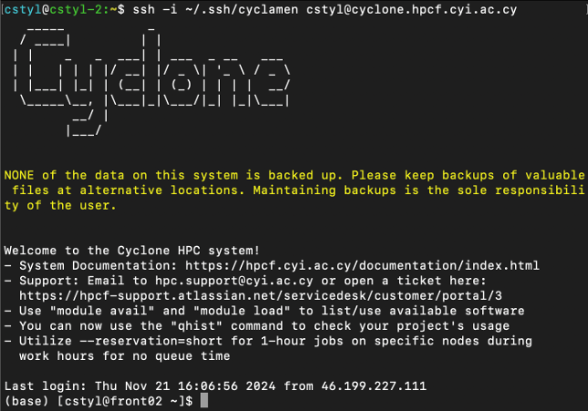

<!--
 g02_Compile_Accessing.md

 CaSToRC, The Cyprus Institute

 (c) 2024 The Cyprus Institute

 Contributing Authors:
 Christodoulos Stylianou (c.stylianou@cyi.ac.cy)
 
 Licensed under the Apache License, Version 2.0 (the "License");
 you may not use this file except in compliance with the License.
 You may obtain a copy of the License at
 
     https://www.apache.org/licenses/LICENSE-2.0
 
 Unless required by applicable law or agreed to in writing, software
 distributed under the License is distributed on an "AS IS" BASIS,
 WITHOUT WARRANTIES OR CONDITIONS OF ANY KIND, either express or implied.
 See the License for the specific language governing permissions and
 limitations under the License.
-->

# **2. Accessing Cyclone**

<div style="text-align: justify;">
This guide provides step-by-step instructions for accessing the Cyclone HPC system securely and efficiently using SSH. It covers generating SSH keys, connecting to Cyclone, configuring your SSH setup, and troubleshooting common issues for **Mac**, **Linux**, and **Windows** platforms.
</div>

---

## **2.1 What is SSH and Why is it Important?**

<div style="text-align: justify;">
SSH, or Secure Shell, is a secure way to access and manage remote systems, such as High-Performance Computing (HPC) resources, over a network. It encrypts all communication, protecting sensitive information from being intercepted by unauthorized users. SSH is essential because it provides a safe and efficient way to connect to powerful remote systems for tasks like running simulations, managing files, and analyzing data. Instead of using vulnerable passwords, SSH often uses a system called public-key cryptography to verify your identity.

Here’s how it works: SSH relies on a pair of keys—a **public key** and a **private key**. The public key is shared with the remote system (the server), acting like a lock, while the private key stays safely on your computer, working as the unique key that can open that lock. When you try to connect, the server sends a challenge that only your private key can solve. If it’s solved correctly, the server knows it’s you, and the connection is established securely. This approach ensures that even if someone intercepts the communication, they can’t access your data or impersonate you. SSH combines simplicity and robust security, making it an indispensable tool for accessing and using HPC systems effectively.
</div>

---

## **2.2 Generating an SSH Key**

To connect to Cyclone, you need to generate an SSH key pair. Follow the instructions for your platform below:

### **2.2.1 Mac/Linux**

1. Open a terminal.
   - **Mac**: Press `Cmd + Space`, type `Terminal`, and press **Enter**.
   - **Linux**: Open your terminal application.

2. Generate a new SSH key pair:
   ```bash
   ssh-keygen -t rsa -b 4096 -C "your_email@example.com"
   ```
   - Save the key to the default location (`~/.ssh/id_rsa`).
   - Optionally, set a passphrase for extra security.

3. Add the key to the agent:
   ```bash
   eval "$(ssh-agent -s)"
   ssh-add ~/.ssh/id_rsa
   ```

---

### **2.2.2 Windows**

Choose <u>**one**</u> of the following methods to generate an SSH key:

#### **Option 1: Using PowerShell (Requires Admin Access)**
1. Open PowerShell:
   - Press `Win + S`, type **"PowerShell"**, and press **Enter**.

2. You might want to [check if OpenSSH is installed first](utils/Windows_SSH_Setup.md#1-openssh).

3. Generate a new SSH key:
   ```powershell
   ssh-keygen -t rsa -b 4096 -C "your_email@example.com"
   ```
   - Save the key to the default location (`~/.ssh/id_rsa`).
   - Optionally, set a passphrase.

4. Add the key to the agent:
   ```powershell
   Start-Service ssh-agent
   ssh-add ~\.ssh\id_rsa
   ```

#### **Option 2: Using WSL (Requires Admin Access)**
1. Open a WSL terminal:
   - Press `Win + S`, type **"WSL"**, and press **Enter**.
   - If WSL is not installed, refer to the [Installation Guide](utils/Windows_SSH_Setup.md#2-wsl).

2. Generate a new SSH key:
   ```bash
   ssh-keygen -t rsa -b 4096 -C "your_email@example.com"
   ```
3. Add the key to the agent:
   ```bash
   eval "$(ssh-agent -s)"
   ssh-add ~/.ssh/id_rsa
   ```

#### **Option 3: Using Git Bash (No Admin Access Needed)**
1. Open Git Bash:
   - If Git Bash is not installed, refer to the [Installation Guide](utils/Windows_SSH_Setup.md#3-git-bash).
   - Press `Win + S`, type **"Git Bash"**, and press **Enter**.

2. Generate a new SSH key:
   ```bash
   ssh-keygen -t rsa -b 4096 -C "your_email@example.com"
   ```
3. Add the key to the agent:
   ```bash
   eval "$(ssh-agent -s)"
   ssh-add ~/.ssh/id_rsa
   ```

---

## **2.3 Connecting to Cyclone**

Once you have generated an SSH key, follow these steps to connect to Cyclone:

1. Open your terminal:
   - **Mac/Linux**: Use your terminal application.
   - **Windows (PowerShell)**: Press `Win + S`, type **"PowerShell"**, and press **Enter**.
   - **Windows (WSL)**: Press `Win + S`, type **"WSL"**, and press **Enter**.
   - **Windows (Git Bash)**: Press `Win + S`, type **"Git Bash"**, and press **Enter**.

2. Connect to Cyclone using:
   ```bash
   $ ssh your_username@cyclone.hpcf.cyi.ac.cy
   ```

**Example**:
   ```bash
   ssh cstyl@cyclone.hpcf.cyi.ac.cy
   ```

Upon successful login, you will see a welcome message, as shown below:


---

## **2.4 Configuring SSH with a Config File**

An SSH config file allows you to save connection settings like the hostname, username, and private key location for simpler access.

### **Mac/Linux**
1. Open the SSH configuration file or create one:
   ```bash
   nano ~/.ssh/config
   ```
2. Add the following configuration:
   ```
   Host cyclone
       HostName cyclone.hpcf.cyi.ac.cy
       User your_username
       IdentityFile ~/.ssh/id_rsa
   ```
3. Save and exit. Now you can connect with:
   ```bash
   ssh cyclone
   ```

### **Windows**
1. Navigate to the `.ssh` directory:
   ```powershell
   cd ~\.ssh
   ```
   or
   ```bash
   cd ~/.ssh
   ```

2. Create the config file:
   ```powershell
   notepad config
   ```
3. Add the same configuration as above. Ensure the file has no extension.

**Important**: If file extensions are hidden, see [below](#253-changing-and-removing-file-extensions-windows) for instructions on how to make .

---

## **2.5 Notes and Troubleshooting**

### **2.5.1 Installing Required Tools**
If you don’t have OpenSSH, WSL, or Git Bash installed, refer to the [Installation Guide](utils/Windows_SSH_Setup.md).

---

### **2.5.2 `~/.ssh` directory does not exist on Windows**

#### **Option 1: Using Powershell**
1. Open PowerShell.
   - **Press Windows Key > Search "Windows PowerShell" > Enter**
2. Navigate to your Home directory
    ```powershell
    cd ~
    ```
    This will take you to your home directory, typically something like `C:\Users\<YourUsername>`.
3. Create the `.ssh` directory:
   ```powershell
    mkdir .ssh
   ```
4. Verify that the directory was created:
   ```powershell
    ls .ssh
   ```
   If the `.ssh` folder exists, the command will list its contents (it may be empty if just created).

#### **Option 2: Using File Explorer**
1. Open File Explorer.
2. Navigate to your home directory: `C:\Users\<YourUsername>`.
3. Create a new folder named `.ssh`:
    - Right-click and choose **New > Folder**.
    - Name it `.ssh` (include the period).
    - Confirm if prompted about using a name that starts with a period.

---

### **2.5.3 Changing and Removing File Extensions (Windows)**
File extensions (like `.txt`, `.png`, `.exe`) are often hidden by default in Windows, so you'll first need to make extensions visible before removing or changing them.
1. Open **File Explorer**.
   - Press **Win + E** or click the folder icon in the taskbar.
2. Access View Options:
    - **Windows 10**: Click on the View tab in the toolbar at the top.
    - **Windows 11**: Click on the three dots (`...`) in the toolbar at the top and choose **Options**.
3. Click on the tab **View**, go to *"Advanced settings"* and uncheck the checkbox *"Hide extensions for known file types"* if already checked.
4. (Now that the extension is visible) Rename the file:
   - Right-click the file and choose **Rename**.
   - Remove or modify the extension as needed.
   - Confirm the change when prompted.

---

### **2.5.4. Show/Unhide `.ssh` directory (Windows)**
File extensions (like `.txt`, `.png`, `.exe`) are often hidden by default in Windows, so you'll first need to make extensions visible before removing or changing them.
1. Open **File Explorer**.
   - Press **Win + E** or click the folder icon in the taskbar.
2. Access View Options:
    - **Windows 10**: Click on the View tab in the toolbar at the top.
    - **Windows 11**: Click on the three dots (`...`) in the toolbar at the top and choose **Options**.
3. Click on the tab **View**, go to *"Advanced settings"*.
4. Scroll down to *"Hidden files and folders"* and select the option **Show hidden files, folders, and drives**.
---