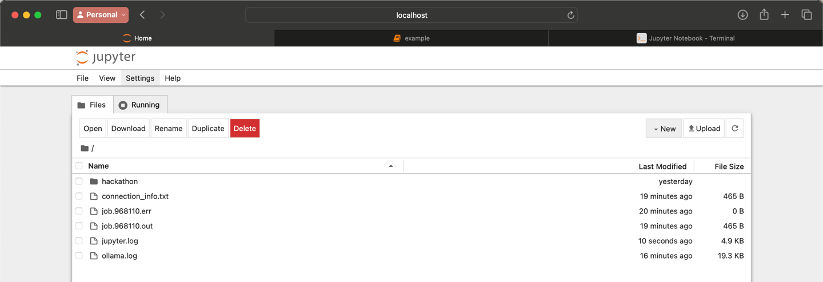

<!--
 t04_Jupyter.md

 CaSToRC, The Cyprus Institute

 (c) 2024 The Cyprus Institute

 Contributing Authors:
 Christodoulos Stylianou (c.stylianou@cyi.ac.cy)
 
 Licensed under the Apache License, Version 2.0 (the "License");
 you may not use this file except in compliance with the License.
 You may obtain a copy of the License at
 
     https://www.apache.org/licenses/LICENSE-2.0
 
 Unless required by applicable law or agreed to in writing, software
 distributed under the License is distributed on an "AS IS" BASIS,
 WITHOUT WARRANTIES OR CONDITIONS OF ANY KIND, either express or implied.
 See the License for the specific language governing permissions and
 limitations under the License.
-->

## **Tutorial 4: Running Jupyter Notebook on Compute Nodes**
## **4.1 Objective**
This tutorial aims to guide users through the process of launching a Jupyter Notebook on Cyclone's compute nodes to execute Python-based workflows interactively. Using the example from Tutorial 2 (training a PyTorch-based AI model), users will learn how to set up and interact with Jupyter Notebooks running remotely on Cyclone. This tutorial emphasizes resource-efficient workflows while leveraging Cyclone's computational capabilities.


## **4.2 Workflow**
### **4.2.1 Create Conda Environment**
1. **Load the Anaconda Module**:
   ```bash
   module load Anaconda3/2023.03-1
   ```

2. **Create a Conda Environment**:
   ```bash
   conda create -n ai_env python=3.9 -y
   conda activate ai_env
   ```

3. **Install Required Libraries**:
   ```bash
   pip install jupyter torch torchvision matplotlib
   ```

---

### **4.2.2 Prepare the SLURM Scripts**
Follow the example provided in **[Guide 8: Launching Jupyter Notebooks](../Guides/g08_Cyclone_Launching%20Jupyter.md)** to create the necessary SLURM scripts for running on CPU and GPU nodes.

#### **On CPU**
```bash
#!/bin/bash
#SBATCH --job-name=<your_job_name>
#SBATCH --time 00:15:00
#SBATCH --nodes=1
#SBATCH --ntasks-per-node=1
#SBATCH --cpus-per-task=10
#SBATCH --partition=cpu
#SBATCH --output=%x-%j.out
#SBATCH --account=<your_account>    # Replace
 
# Environment Setup
module load Anaconda3/2023.03-1
source ~/.bashrc
conda activate ai_env
 
# Figure out current script path
if [ -n "${SLURM_JOB_ID:-}" ] ; then
    SCRIPT_PATH=$(scontrol show job "$SLURM_JOB_ID" | awk -F= '/Command=/{print $2}')
else
    SCRIPT_PATH=$(realpath "$0")
fi
SCRIPT_DIR=$(dirname $SCRIPT_PATH)

# Choose random ports
read PORT1 <<< $(shuf -i 5000-5999 -n 1 | tr '\n' ' ')

# Launches Jupyter Notebook on the compute node without opening a browser
# Notebook is bound to the randomly selected port 
jupyter notebook --no-browser --port $PORT1 &
sleep 10
 
# Define the file path
file="${SLURM_JOB_NAME}-${SLURM_JOBID}.out"
# Extract addresses using grep and regex patterns
address1=$(grep -o 'ServerApp] http://localhost:[0-9]\+/?token=[a-zA-Z0-9]\+' "$file" | awk '{print $2}')

LOGIN_HOST="cyclone.hpcf.cyi.ac.cy"
BATCH_HOST=$(hostname)
OUTPUT_FILE="$SCRIPT_DIR/connection_instructions.txt"
 
echo "##################################################################################################" > "$OUTPUT_FILE"
echo "To connect to the notebook type the following command into your local terminal:" >> "$OUTPUT_FILE"
echo "ssh -N -J ${USER}@${LOGIN_HOST} ${USER}@${BATCH_HOST} -L ${PORT1}:localhost:${PORT1}" >> "$OUTPUT_FILE"
echo "" >> "$OUTPUT_FILE"
echo "After the connection is established in your local browser, go to the following addresses:" >> "$OUTPUT_FILE"
echo "Jupyter notebooks: ${address1}" >> "$OUTPUT_FILE"
echo "##################################################################################################" >> "$OUTPUT_FILE"
 
sleep infinity
```

#### **On GPU**
Add the line `#SBATCH --gres=gpu:1` and change partition to `--partition=gpu`,

---

### **4.2.3 Submit the Script**
Submit the job to SLURM:
```bash
sbatch launch_jupyter_gpu.slurm  # For GPU
# OR
sbatch launch_jupyter_cpu.slurm  # For CPU
```
After the job starts, a file named `connection_instructions.txt` will be created in the same directory. This file contains the SSH tunneling command and the notebook URL.

---

### **4.2.4 SSH Tunneling**
Locate the tunneling command in `connection_instructions.txt`. It looks like:
```bash
ssh -N -J <username>@cyclone.hpcf.cyi.ac.cy <username>@<batch-node> -L <port>:localhost:<port>
```
Open a new terminal and run this command on your local machine.

---

### **4.2.5 Accessing The Notebook**
1. Open a browser on your local machine.
2. Navigate to the URL provided in connection_instructions.txt. It typically looks like:
    ```bash
    http://localhost:<port>/?token=<token>
    ```
Upon successful connection, you should see in your screen something similar as below:



### **4.2.6 Open the Notebook**
In the browser, locate the file `train_model.ipynb` and open it. It should now be running on the compute node of Cyclone.

---